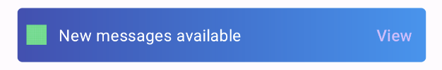
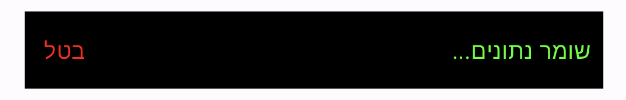

# BetterSnacks

**Elevate your Android app's user experience with BetterSnacks, a powerful and customizable library that enhances the standard Material Design Snackbar.** Building upon the familiar Builder pattern, BetterSnacks introduces a range of engaging features, including dynamic animations, tactile vibrations, auditory cues, custom icons, and comprehensive RTL support.

## ✨ Key Features

* **Versatile Snackbar Types**: Choose from specialized snackbar variations like `UndoSnackbar` for reversible actions, `InfoSnackbar` for informative messages, and `TimedSnackbar` for time-sensitive notifications.
* **Engaging Animations**: Bring your snackbars to life with smooth animations: `Slide`, `Fade`, `Scale`, or opt for no animation (`None`).
* **Haptic Feedback**: Provide subtle tactile feedback with optional vibration on snackbar display.
* **Auditory Cues**: Enhance user awareness with customizable sound effects upon snackbar appearance.
* **Custom Visuals**: Add a personal touch by incorporating custom icons alongside your messages.
* **Layout Adaptability**: Seamlessly support both Right-to-Left (RTL) and Left-to-Right (LTR) layouts for global accessibility.
* **Tailored Aesthetics**: Customize the visual appearance with options for background, text, and action button colors, as well as gradients and borders.
* **Intuitive Configuration**: Leverage the chainable Builder pattern for a straightforward and expressive way to configure your snackbars.
* **Build and Show**: Offers both `show()` for immediate display and `build()` for creating a `Snackbar` instance to be managed independently.

---

## ⚙️ Installation
**Add the library dependency**:

Ensure that your project is configured to fetch the library from JitPack. Update your **`settings.gradle`** and **`build.gradle`** as follows:
#### **`settings.gradle`**
```kotlin
dependencyResolutionManagement {
  repositoriesMode.set(RepositoriesMode.FAIL_ON_PROJECT_REPOS)
  repositories {
      google()
      mavenCentral()
      maven {
          url = uri("[https://jitpack.io](https://jitpack.io)")
      }
  }
}
````

#### **`build.gradle` (App Module)**

Add the library dependency to your app module's dependencies block:

```kotlin
dependencies {
  implementation("com.github.Itay-Biton:BetterSnacks:v1.0.0")
}
```

Sync your Gradle project after adding these changes.

---

## 🛠️ Usage

Here are examples demonstrating how to implement the different Snackbar types with combined customization options:

### 1. Undo Snackbar with Custom Appearance and Effects

```java
new UndoSnackbar.Builder(this) // Use 'this' if calling from an Activity
    .message("Document archived")
    .actionText("Restore")
    .onUndo(() -> {
        // Implement your restore logic here
        Log.d("BetterSnacks", "Restore action triggered");
    })
    .animation(BaseSnackbar.AnimationType.SLIDE_IN_BOTTOM)
    .vibrateOnShow(true)
    .vibrationDuration(200)
    .soundOnShow(true)
    .sound(R.raw.archive_sound) // Assuming you have a sound file named 'archive_sound'
    .backgroundColor(Color.parseColor("#4CAF50")) // Green background
    .textColor(Color.WHITE)
    .actionTextColor(Color.YELLOW)
    .cornerRadius(8)
    .show();
```

<p align="center">Undo Snackbar with Custom Appearance and Effects</p>
<p align="center">
  
</p>

### 2. Info Snackbar with Gradient and Icon

```java
// If you are within a Fragment or have a specific View:
View rootView = findViewById(android.R.id.content);
new InfoSnackbar.Builder(rootView)
    .message("New messages available")
    .actionText("View")
    .onConfirm(() -> {
        // Handle the view action
        Toast.makeText(this, "Opening messages...", Toast.LENGTH_SHORT).show();
    })
    .animation(BaseSnackbar.AnimationType.FADE_IN)
    .icon(ContextCompat.getDrawable(this, R.drawable.ic_message)) // Assuming you have an icon named 'ic_message'
    .gradient(new int[]{Color.parseColor("#3F51B5"), Color.parseColor("#2196F3")}, GradientDrawable.Orientation.LEFT_RIGHT) // Blue gradient
    .textColor(Color.WHITE)
    .cornerRadius(12)
    .show();
```

<p align="center">Info Snackbar with Gradient and Icon</p>
<p align="center">
  
</p>

### 3. Timed Snackbar with Border and RTL Support

```java
new TimedSnackbar.Builder(findViewById(R.id.your_coordinator_layout)) // Ensure you have a CoordinatorLayout
    .message("שומר נתונים...")
    .actionText("בטל")
    .onAction(() -> {
        // Logic to execute when the cancel button is clicked
        Log.i("BetterSnacks", "Saving cancelled");
    })
    .onTimeout(() -> {
        // Code to run when the snackbar times out
        Toast.makeText(this, "Data saved automatically", Toast.LENGTH_SHORT).show();
    })
    .duration(5000) // Show for 5 seconds
    .layoutDirection(View.LAYOUT_DIRECTION_RTL) // Example for RTL layout
    .backgroundColor(Color.BLACK)
    .textColor(Color.GREEN)
    .actionTextColor(Color.RED)
    .border(Color.WHITE, 3)
    .show();
```

<p align="center">Timed Snackbar with Border and RTL Support</p>
<p align="center">
  
</p>

---

## ⚙️ Customization Options

The following methods are available within the Builder for each Snackbar type, allowing for extensive customization:

| Method                     | Description                                          |
| :------------------------- | :--------------------------------------------------- |
| `message(String)`          | Sets the primary message text.                       |
| `actionText(String)`       | Sets the text for the action button.                 |
| `duration(int)`            | Sets the display duration in milliseconds.           |
| `layoutDirection(int)`     | Configures the layout direction (e.g., `View.LAYOUT_DIRECTION_RTL`, `View.LAYOUT_DIRECTION_LTR`). |
| `backgroundColor(int)`     | Sets a custom background color for the snackbar.     |
| `textColor(int)`           | Sets a custom color for the message text.            |
| `actionTextColor(int)`     | Sets a custom color for the action button text.      |
| `icon(Drawable)`           | Displays a custom icon next to the message.          |
| `animation(AnimationType)` | Sets the animation style (`NONE`, `FADE_IN`, `SCALE`, `SLIDE_IN_BOTTOM`). |
| `vibrateOnShow(boolean)`   | Enables or disables vibration on snackbar display.    |
| `vibrationDuration(long)`  | Sets the duration of the vibration in milliseconds.  |
| `soundOnShow(boolean)`     | Enables or disables sound playback on snackbar display. |
| `sound(int resId)`         | Sets a custom sound resource to play.               |
| `cornerRadius(int)`        | Sets the corner radius of the snackbar background.    |
| `gradient(int[], GradientDrawable.Orientation)` | Sets a gradient background with specified colors and orientation. |
| `border(int, int)`          | Sets a border with a specified color and width.        |
| `build()`                  | Creates a `Snackbar` instance for manual control.    |
| `show()`                    | Builds and immediately displays the `Snackbar`.        |

---

